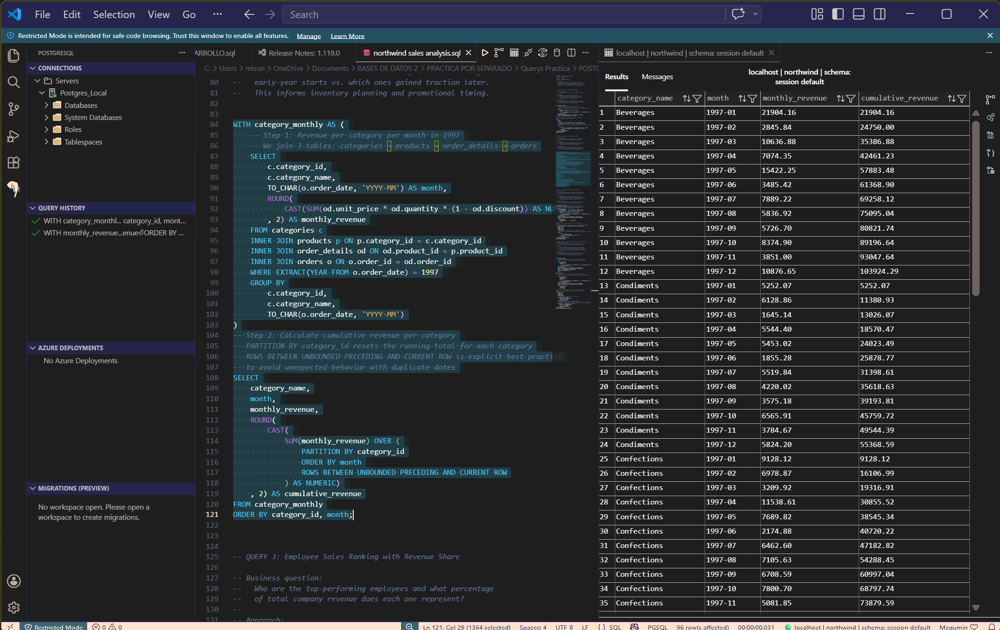
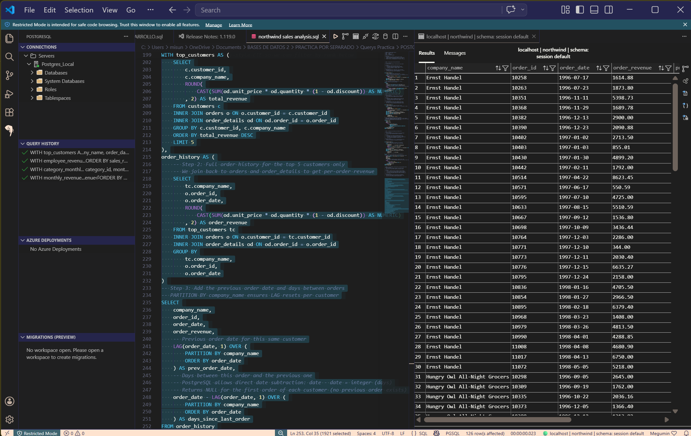

# Northwind Sales Analysis - SQL Portfolio

## Project Overview
This project demonstrates advanced SQL techniques for business intelligence using the classic **Northwind** database. The analysis focuses on key sales metrics, customer behavior, and employee performance to provide actionable insights for decision-making.

## Key Features & SQL Techniques
- **End-to-End Sales Trends:** Monthly revenue calculation with Month-over-Month (MoM) growth analysis.
- **Performance Ranking:** Using `RANK()` and `DENSE_RANK()` to identify top-performing employees and categories.
- **Customer Loyalty Analysis:** Implementation of `LAG()` window functions to calculate the frequency of orders and time gaps between purchases.
- **Complex Aggregations:** Utilizing Common Table Expressions (CTEs) for clean, readable, and modular code.

## Business Questions Answered
1. Is the business growing month-over-month?
2. Which product categories drive the most revenue?
3. Who are the top 5 customers and what is their purchasing pattern?
4. Which employees are exceeding sales targets?

## How to Use
1. Clone the repository: `git clone https://github.com/[Your-Username]/[Your-Repo-Name].git`
2. Navigate to the `queries/` folder.
3. Run `01_northwind_sales_analysis.sql` in any PostgreSQL environment (or SQL Server with minor syntax adjustments).

## Tools Used
- **Database:** PostgreSQL / T-SQL
- **Interface:** Visual Studio Code

## Analysis Visualizations

### 1. Sales Trends

### 2. Category Performance

### 3. Customer Behavior

### 4. SQL Execution Environment

